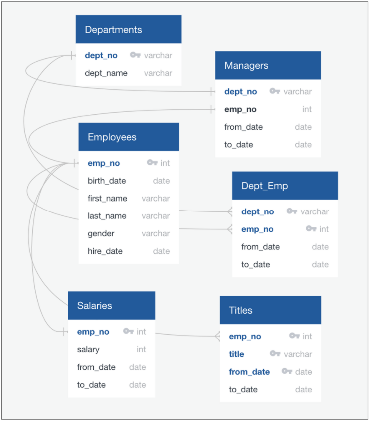

# Pewlett Hackard Analysis

Employee DB
SQL
pgAdmin4

## Objectives

* Create an ERD to map out the relationship of the datasets.
* Start a new SQL DB in pgAdmin4.
* Import csv files to created tables.
* Join tables and crate new tables.
* Export newly made tables to csv files.
* Use SQL query statements.

The main goal was to plan and prepare for the "silver tsunami".  Using pgAdmin4 to compile employee data and key in on specific demographic workforce fitting criteria for retirement and mentorship.  To arrive at the data table needed to understand the number of employees retiring data was imported to a SQL database using pgAdmin4.  Once the data was imported into the data tables made.  The data was then joined into new tables from established primary and foreign keys.

To start it is helpful to map out the relationships of the data using quickdatabasediagrams.com:

